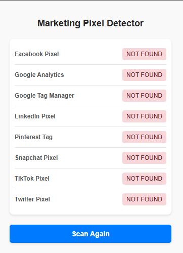
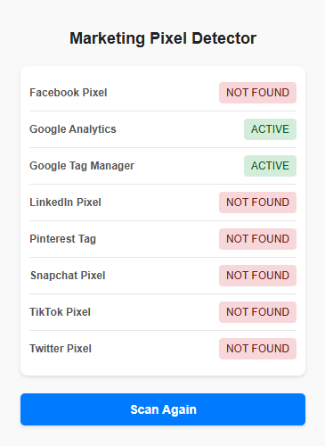

# Marketing Pixel Detector

### Overview

Marketing Pixel Detector is a lightweight browser extension designed to detect active marketing pixels on websites. This
tool is ideal for marketers, developers, and privacy enthusiasts who want to understand what tracking mechanisms are in
place on the web pages they visit.

---

### Features

- **Pixel Detection**: Identifies active marketing pixels (such as Facebook Pixel, Google Analytics, etc.) on any
  website.
- **Easy Access**: Use the browser action popup for quick and simple access to pixel detection results.
- **Lightweight and Fast**: Built for efficiency with minimal performance impact on your browser.

---

### Permissions

- **`activeTab`**: Allows the extension to access the currently opened tab for pixel detection.
- **`scripting`**: Enables dynamic scripts to analyze and detect marketing pixels on web pages.

---

### Screenshots

The following screenshots showcase the functionality of the Marketing Pixel Detector:

- **Screenshot 1**: Pixel detection results displayed in the browser action popup.
  
- **Screenshot 2**: Overview of detected pixels on a sample webpage.
  